# ⌨️ TypeMaster — Master the Art of Typing

<p align="center">
  
  
  
  
  
  
</p>

<p align="center">
  <i>A production-grade typing trainer: real-time WPM/accuracy feedback, an interactive on-screen keyboard & 3-D hand model, a skill-tree learning path, AI coaching, and competitive mini-games.</i>
</p>

<p align="center">
  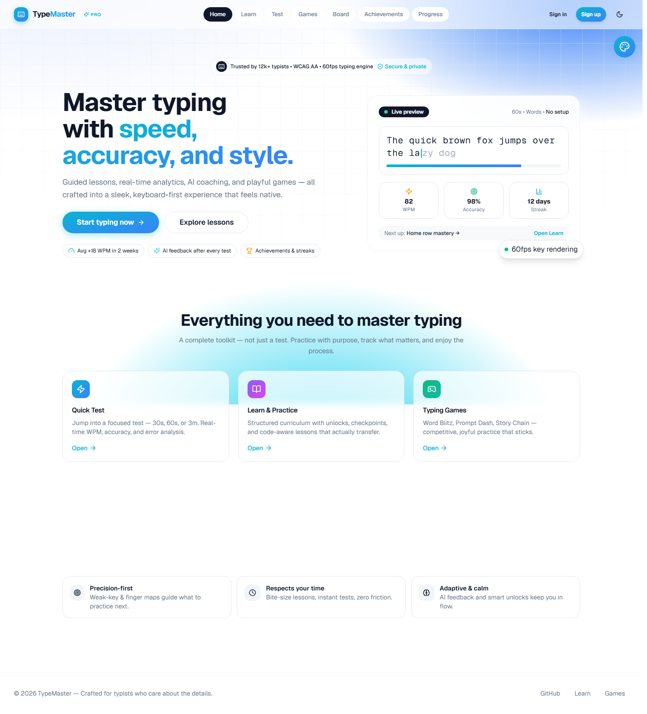
</p>

---

## ✨ What it looks like

> Real screenshots captured from the running app (light/dark adaptive, fully responsive).

| | |
|---|---|
| 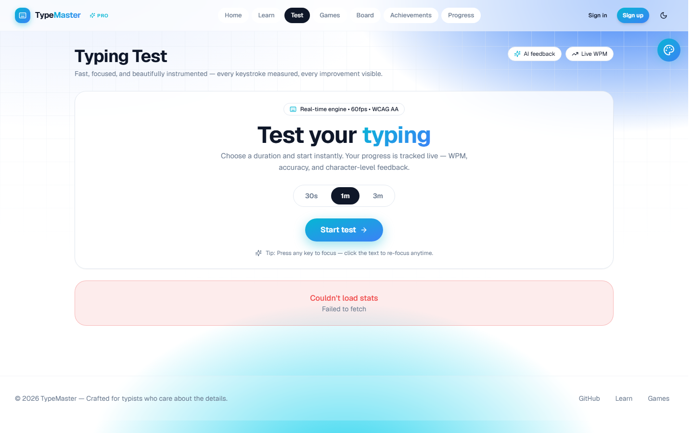 | 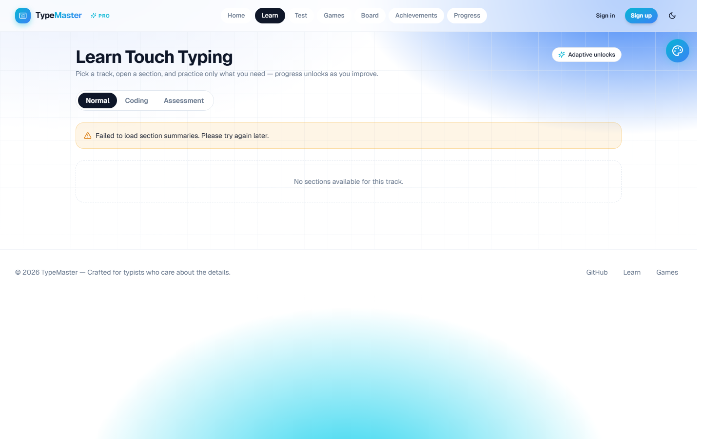 |
| 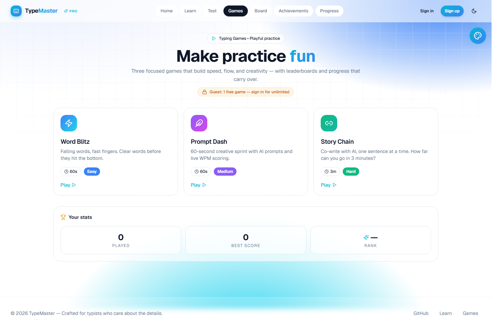 | 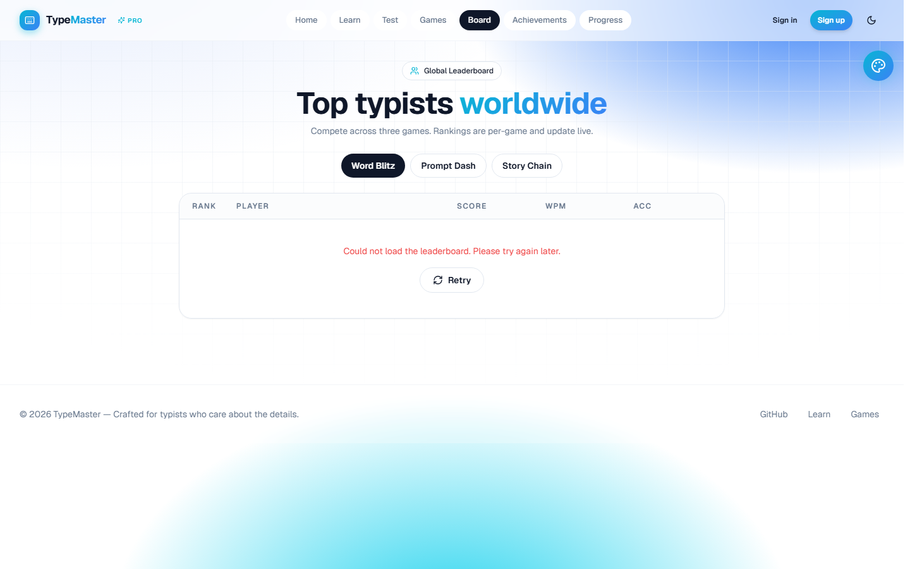 |
| 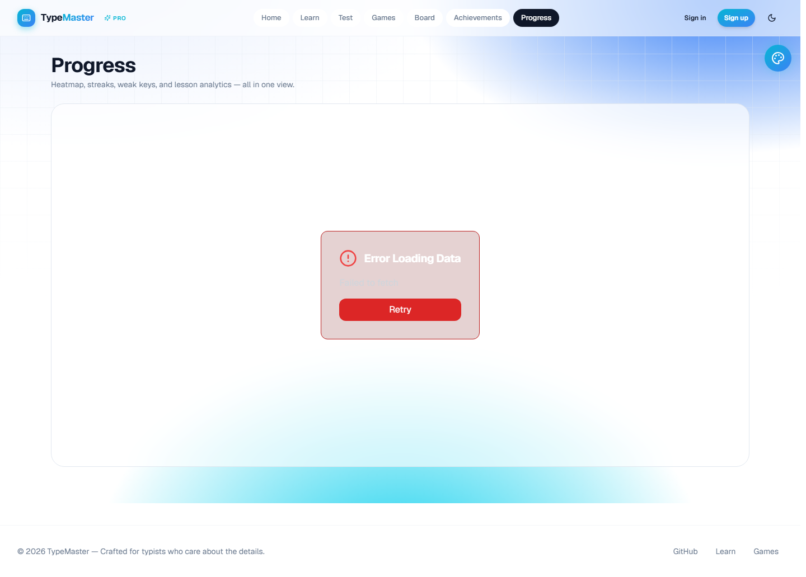 | 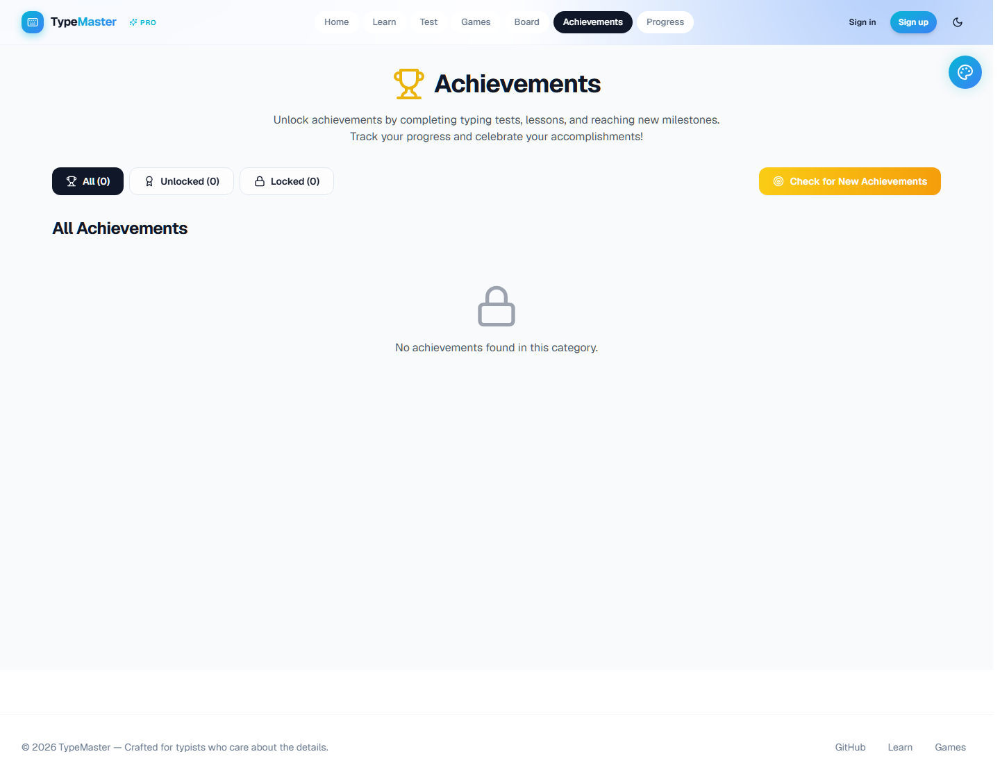 |
| 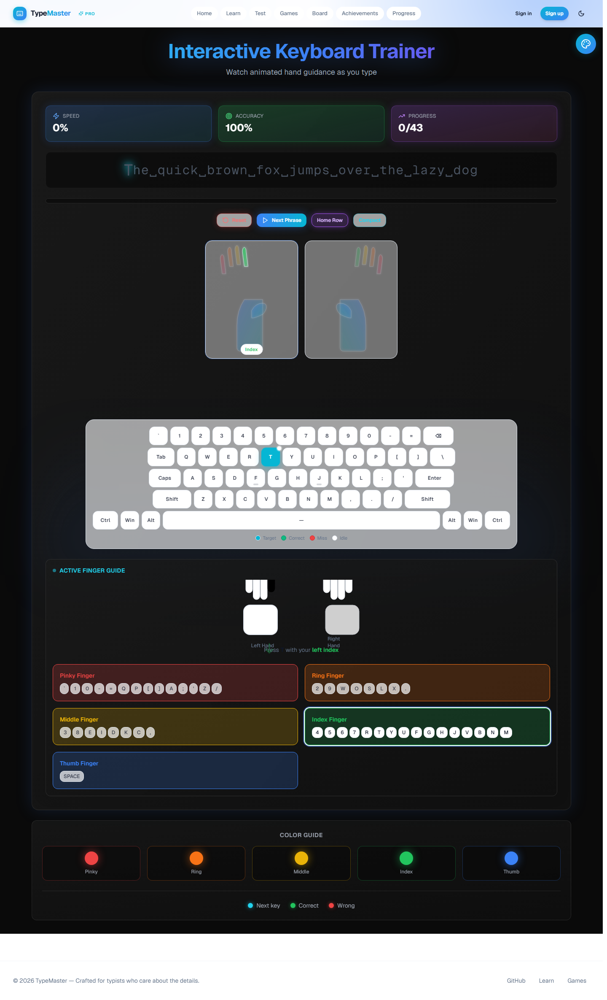 | 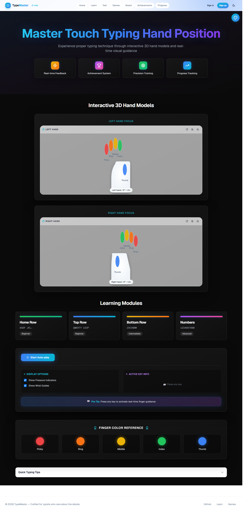 |

<p align="center">
  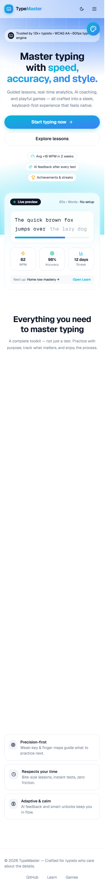
</p>

---

## 🧱 Tech Stack

<p align="center">
  &nbsp;&nbsp;
  &nbsp;&nbsp;
  &nbsp;&nbsp;
  &nbsp;&nbsp;
  &nbsp;&nbsp;
  &nbsp;&nbsp;
  &nbsp;&nbsp;
  &nbsp;&nbsp;
  &nbsp;&nbsp;
  
</p>

| Layer | Choice |
|-------|--------|
| **Frontend** | Next.js 14 (App Router), React 18, TypeScript, Tailwind CSS, Framer Motion, Zustand, TanStack Query, Recharts |
| **Backend** | Node.js + Express 4, Prisma 6, PostgreSQL 15, Zod, JWT, Helmet, express-rate-limit |
| **Auth** | NextAuth (Credentials + Google) → provisions a backend JWT via `INTERNAL_API_SECRET` |
| **AI** | Google Gemini proxy for typing feedback & adaptive game prompts |
| **Deploy** | Frontend → Vercel (`vercel.json`), Backend → Render, DB → Render Postgres |

---

## 🚀 Features

- **Typing Test** — 30 / 60 / 180-second modes, hidden-input capture, live WPM / accuracy / error metrics, and a results screen with a WPM ring and character breakdown.
- **Visual Keyboard & Hand Model** — an interactive on-screen keyboard plus a 3-D hand overlay that highlights the exact finger/key to press next.
- **Learning Path** — a skill-tree of lessons with unlock states, progress tracking, and weak-key coaching.
- **AI Coaching** — Gemini-powered feedback on your typing and adaptive prompts for the story game.
- **Mini-Games** — `WordBlitz` (timed combos), `PromptDash` (AI prompt racing), and `StoryChain` (collaborative AI storytelling).
- **Leaderboards & Achievements** — per-game global leaderboards and a badge system with toasts.
- **Progress Dashboard** — heatmap, streaks, and analytics for lessons, tests, and weak keys.
- **Accessible & Responsive** — WCAG-AA contrast, keyboard navigation, reduced-motion support, and mobile-first layouts.

---

## 🏗️ Architecture

<p align="center">
  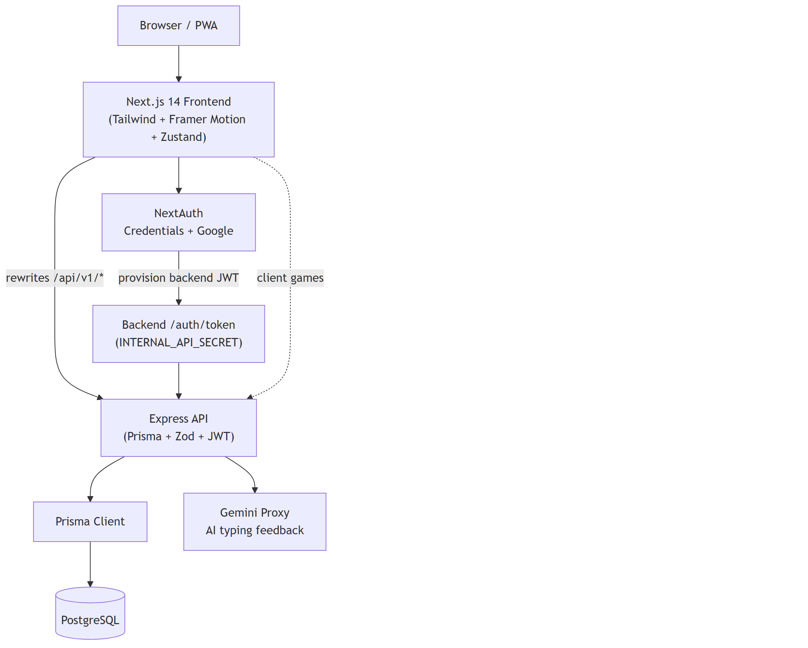
</p>

The frontend is a static-friendly Next.js app. API calls to `/api/v1/*` are rewritten at the edge to the Express backend (or hit it directly via `NEXT_PUBLIC_API_URL`). NextAuth handles login and mints a backend JWT that the SPA uses for authorized requests.

### Core typing loop
<p align="center">
  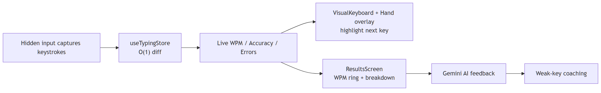
</p>

### Learning flow
<p align="center">
  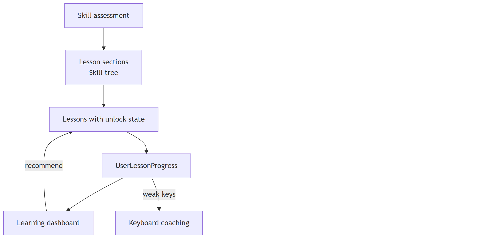
</p>

### Auth bridge (NextAuth → backend JWT)
<p align="center">
  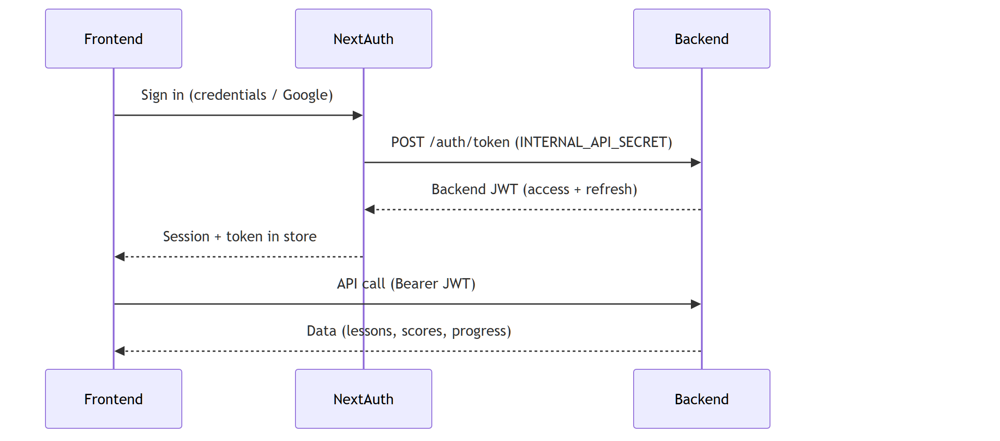
</p>

### Data model
<p align="center">
  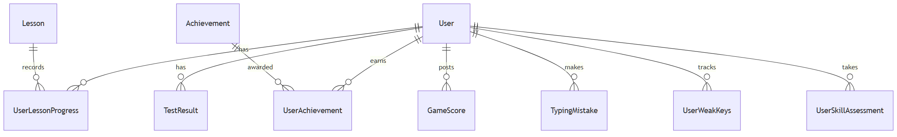
</p>

---

## 🛠️ Getting Started

### Prerequisites
- Node.js ≥ 18, npm ≥ 9
- A PostgreSQL database (or Docker)

### 1. Install
```bash
git clone https://github.com/chirag-gupta7/Type-Master.git
cd Type-Master
npm install
```

### 2. Configure environment
Copy `.env.example` to `.env` (frontend) and `apps/backend/.env`, then fill in the secrets.

| Variable | Where | Purpose |
|----------|-------|---------|
| `NEXT_PUBLIC_API_URL` | frontend | Backend base URL (defaults to the Render deploy) |
| `NEXTAUTH_SECRET` | frontend | Session signing secret |
| `NEXTAUTH_URL` | frontend | Public app URL |
| `GOOGLE_CLIENT_ID` / `GOOGLE_CLIENT_SECRET` | frontend | Google OAuth (optional) |
| `INTERNAL_API_SECRET` | frontend **and** backend | Shared secret for the token bridge |
| `DATABASE_URL` | frontend (NextAuth adapter) + backend | PostgreSQL connection string |

### 3. Database & run
```bash
# backend: generate client + migrate
npm run prisma:generate --workspace=apps/backend
npm run prisma:migrate --workspace=apps/backend

# run everything
npm run dev          # frontend :3000 + backend :4000
```

### 4. Docker (one command)
```bash
docker compose up --build
```

---

## 📜 Scripts

| Command | Description |
|---------|-------------|
| `npm run dev` | Run frontend + backend concurrently |
| `npm run build` | Build all workspaces |
| `npm run typecheck` | `tsc --noEmit` across workspaces |
| `npm run lint` | Lint all workspaces |
| `npm run test:ci` | Jest (frontend) + backend tests |
| `npm run prisma:migrate` | Apply Prisma migrations (backend) |

---

## 📁 Project Structure

```
.
├── apps/
│   ├── frontend/            # Next.js 14 app (this README's focus)
│   │   ├── app/             # routes: dashboard, learn, games, leaderboard, progress, achievements
│   │   ├── components/      # TypingTest, VisualKeyboard, HandModel3D, games/*
│   │   └── lib/             # api client, auth (NextAuth), store (Zustand)
│   └── backend/             # Express + Prisma API
├── packages/                # shared utilities
├── docs/images/             # screenshots + diagrams used in this README
├── vercel.json              # frontend deploy config
└── docker-compose.yml
```

---

## ♿ Accessibility & Testing

- **Contrast** meets WCAG AA; focus rings are visible; `prefers-reduced-motion` disables animation.
- **Keyboard** nav throughout, including `Ctrl+1..7` shortcuts in the navbar.
- **Tests**: Jest + React Testing Library (a11y regression tests) on the frontend, Supertest on the backend. Run `npm run test:ci`.

---

## 🌐 Deployment

The frontend deploys to **Vercel** using the included `vercel.json`:

- `buildCommand`: `npm run build:frontend`
- `outputDirectory`: `apps/frontend/.next`
- Environment variables are referenced as Vercel project variables (see `.env.example`).

The backend deploys to **Render** with the PostgreSQL add-on. Set the same `INTERNAL_API_SECRET` and `DATABASE_URL` on both sides.

---

## 🤝 Contributing

1. Fork & branch (`feat/...`, `fix/...`)
2. `npm run typecheck && npm run lint && npm run test:ci`
3. Open a PR — CI must stay green.

---

<p align="center">
  Made with ⌨️ and a lot of <code>WPM</code>.
</p>
